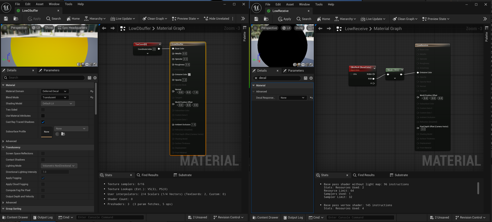
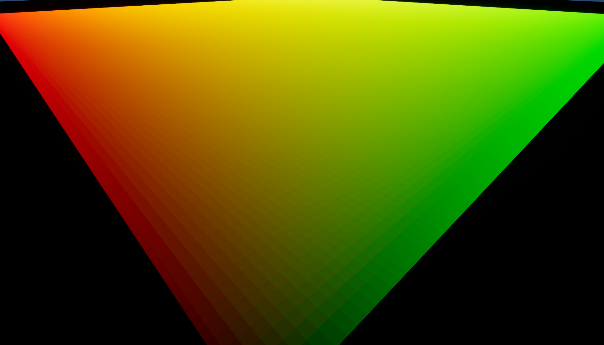
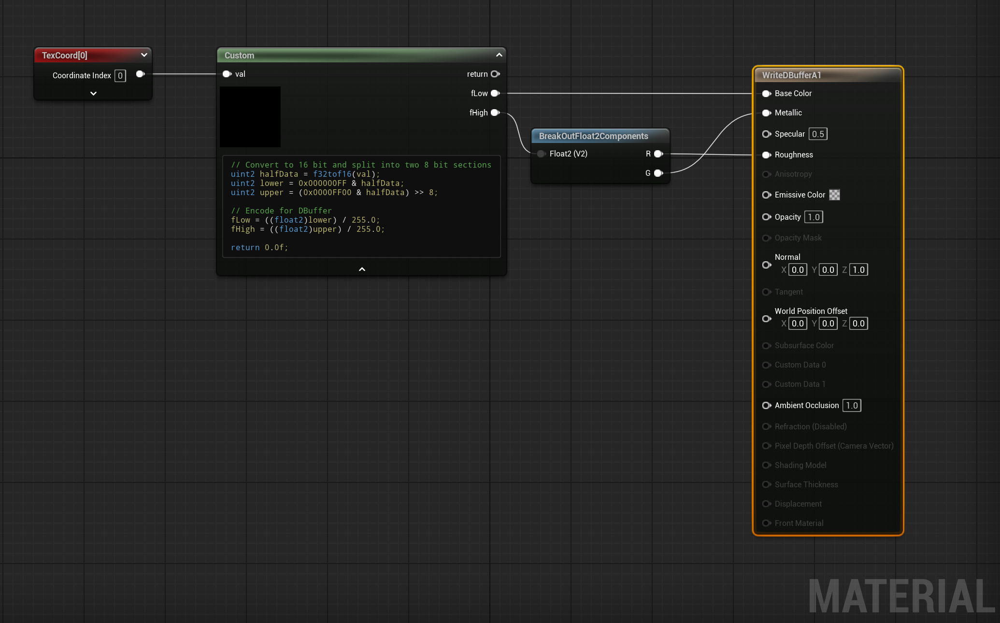
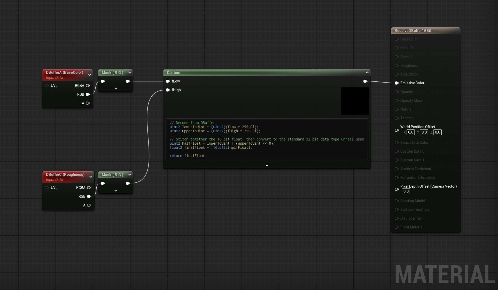
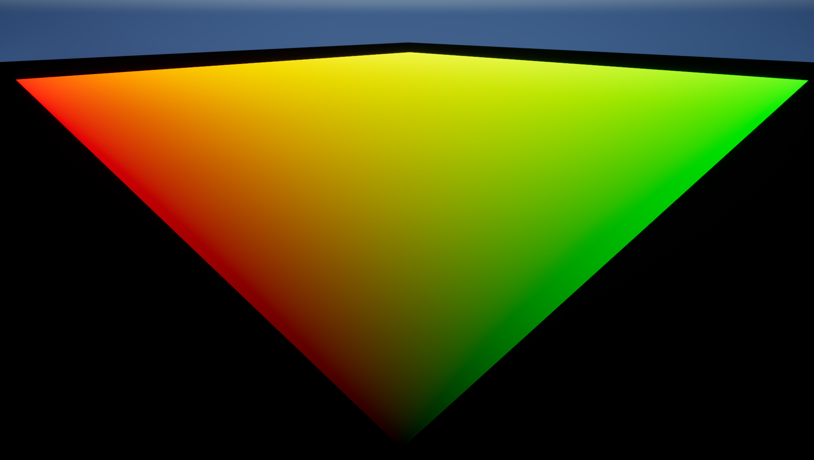

A bit of an odd one, but a snippet worthy of posting online in case it's of use to anyone.

\
Decals are great, super flexible for artists and offers a ton of variety in world building. A great tool to have in a game's toolbox. <a class="link" href="https://dev.epicgames.com/documentation/en-us/unreal-engine/decal-materials-in-unreal-engine">Unreal's Decal Materials</a> give you a lot of power straight out of the box, letting you splat on Base Color, Normal, Roughness, Metallic, and Specular variation through the DBufferA, DBufferB, and DBufferC textures.

\
I've been thinking recently about hijacking these decals to pass in shader parameters to the receiving mesh rather than blending in new PBR values. Decal flowmaps? Improved POM decals? Stuff like that, maybe will have something to showcase in the future. You can use custom decal responses in Unreal materials to disable the traditional blending and instead sample the DBuffer textures directly and do whatever you want with the data.

\
However... there's one main issue with trying to use the DBuffer this way. The DBuffer textures in Unreal use an uncompressed 8 bits per channel (RGBA8), which is not a lot of precision when you're trying to pass in custom data. Also, Unreal expects you to be passing in normal PBR values. So it will clamp your input 32 bit float to a [0, 1] range, and then encodes that as an 8 bit value. That's a major limitation already since you can't pass in any negative values.

\
To see the precision issues first hand, here's the vanilla approach of passing in the decal's UV Coordinates straight up. 

    

    

\
You get pretty obvious stepping when you zoom in. This is also the full range of data we can represent. You can't write in any values above one or below zero.

\
But we can represent a low precision floating point number with 16 bits using <a class="link" href="https://en.wikipedia.org/wiki/Half-precision_floating-point_format"> IEEE 754 Half Precision </a>. And then the theory behind what we need to do is not too complicated. Seperate the lower and upper 8 bits of each float and write them into their own Dbuffer Channel. In my implementation of passing in UV Coordiates, I end up breaking it up like this:

 

    <ul class="bullet">
        

            <li>
                DBufferA (BaseColor) = The lower 8 bits of the X and Y values
            </li>
            <li>
                DBufferC (Roughness / Metallic) = The upper 8 bits of the X and Y values
            </li>
        

    </ul>

\
Hlsl has the <a class="link" href="https://learn.microsoft.com/en-us/windows/win32/direct3dhlsl/dx-graphics-hlsl-scalar">half data type</a> for 16 bit floats however when I use it in a custom unreal node I've found that it ends up being a regular 32 bit float anyways. Modern GPU's probably just do everything with 32 bit operations so I'm not even really sure if that data type is even really supported anymore. 

\
Here's the workaround though. Take our 32 bit float, then use the <a class="link" href="https://learn.microsoft.com/en-us/windows/win32/direct3dhlsl/f32tof16">f32tof16()</a> function to convert it a uint, which is still 32 bit, but holds the 16 bit representation of that float in it's lower 16 bits. It's actually better that it's a uint now since we can perform bit manipulation on it. Masking out the lower 8 bits in one variable, and then masking the upper eights bit in another and subsequently shifting it over 8 bits as well. I originally got the inspiration from <a class="link" href="https://www.youtube.com/watch?v=SYzBnFZUGtk&ab_channel=Alex">this youtube video</a> which is trying to do the same thing although I felt it could be improved to get the exact 16 bit data we want.

\
Now, each variable holds one half of our data, effectively making them an 8 bit uint. There's still one issue though, because we can't just pass this in directly. Unreal forces you to pass in a 32 bit float in the range [0, 1] to the DBuffer and it encodes it to the 8-bit format under the hood. Our uint's represent the integers in the range [0, 255] so we need to once again convert it to the 32 bit float that will get encoded to those bits. That's relatively simple though, cast the uint to a float and divide by 255. Our decal material ends up looking like this:

    

\
In our receiving material, we need to set the decal response to "None" (since we are doing our own custom logic), and then decode the data in the opposite direction. In this case, Unreal is taking the 8 bit data and converting it to a 32 bit float in the range [0, 1] when we sample the DBuffer. We want to know what the bits would be if this was a uint. This is all the same steps just in reverse. Multiply the float by 255, cast to a uint, take the two 8 bit halves and then stitch them together into a uint where the lower 16 bits is the 16 bit representation of our float data. To get this into an actual useable 32 bit float, we then use the <a class="link" href="https://learn.microsoft.com/en-us/windows/win32/direct3dhlsl/f16tof32">f16tof32()</a> function

    

\
All that work (although it's mainly just cheap arithmetic operations), and now we have proper 16 bit UV Coordinates being projected on to our mesh : )

    

