

<center style="white-space: pre-line">
Can download the houdini scene (for free!) over at <a class="link" href='https://quontyn.gumroad.com/l/ikflco'> gumroad!</a>
</center>

\
So I’ve been experimenting with procedural edge damage setups, because I see stylized / low poly games use it a ton. There’s already a lot of workflows out there for it but I specifically wanted to come up with something that had super fast iteration time, was non-destructive, but still retained a ton of artist control so they could specifically target areas of their assets with edge damages of different intensities.

\
Procedural edge damage is certainly nothing new to Houdini. The SideFX Labs team even has it’s own edge damage node (https://www.sidefx.com/docs/houdini/nodes/sop/labs--edge_damage-2.0.html) which honestly works for a lot of situations, it even respects a mask attribute which you can paint on before hand to get a similar result to my setup above.

\
But I also felt that it can be improved upon, the edge damage node requires a lot of parameter tweaking and it’s not very interactive, it’s hard to make local changes (like increasing / decreasing damage intensities) to certain edges which can slow down the workflow a bit. So my main goal for this tool was to make the process more interactive (with the help of a custom python viewer state), more control on intensities and meshing options, and to make the boolean intersections more reliable. 

\
I’ve wrapped up my tool into an HDA with a relatively small graph, definitely download the scene if you want to dig deep into each node! But in this post I’ll do a high level overview of the ideas as well as a small guide on setting up the interactive python viewer state. 

<center style="margin-top:2rem">
    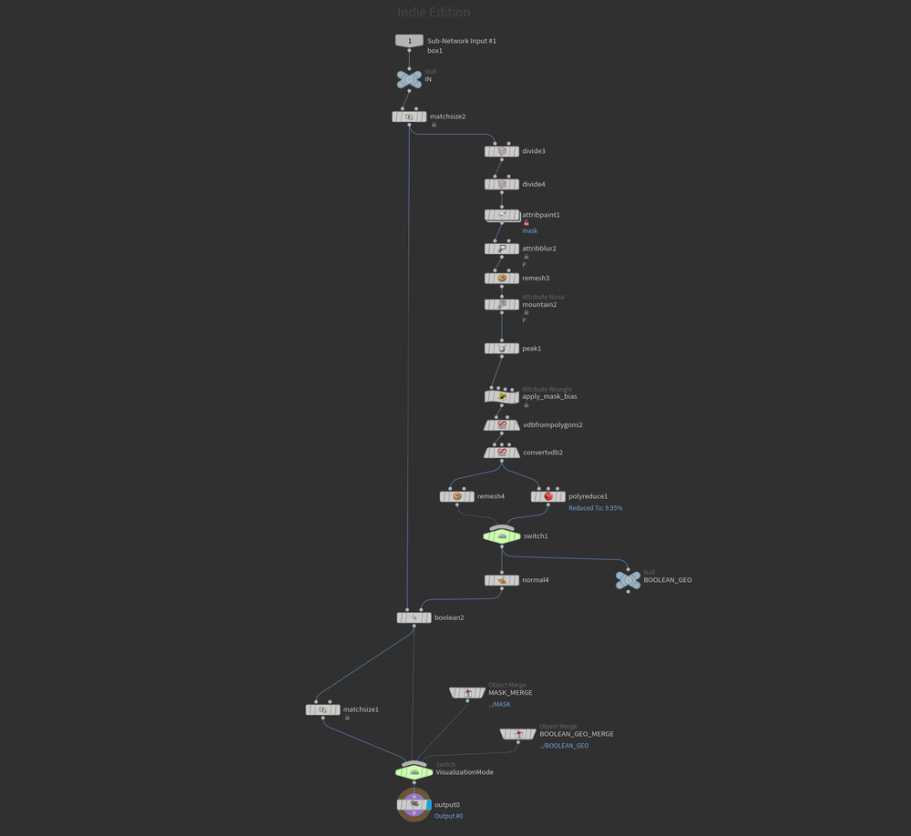
</center>

<hr>
<br>

# Edge Damage Basics

<div>
    <ul class="bullet">
        <br>
        The basic idea for edge damage workflows, which you’ll find most setups use, usually goes something like this:
        <div class="indent">
            <li>
                Get some base asset
            </li>
            <li>
                Subdivide your original mesh so there is more polygon data
            </li>
            <li>
                Blur the positional data of your mesh (so edges get brought in and flat polygons stay flat)
            </li>
            <li>
                Add a noisy, positive offset along the normal of each vert
            </li>
            <li>
                Do a boolean intersection of your noisy mesh and your original geometry
            </li>
        </div>
    </ul>
</div>

<center style="margin-top:2rem">
    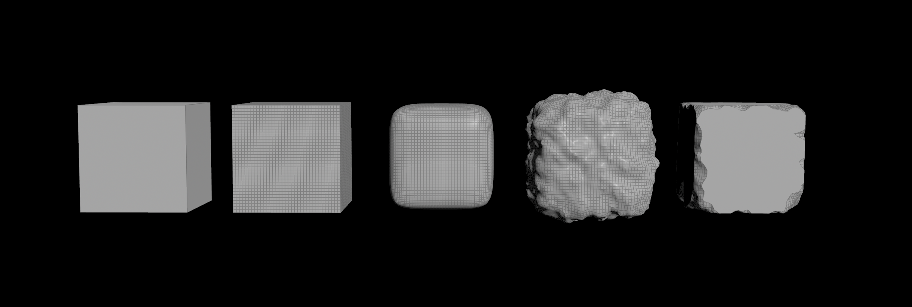
</center>

<hr>
<br>

# The Mask

<br>
To expand on this, we need a mask for where to apply the edge damage. This should be done after subdividing our geometry into the high res variant. Easiest way to do this in Houdini is by using the Attribute Paint node, which is already set up to paint a mask attribute.  

<center style="margin-top:2rem">
    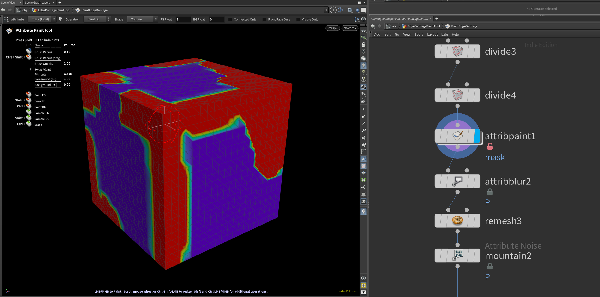
</center>

\
We only want to apply damage in these areas, the approach used in the SideFx Labs tool is to weigh the positional blur based on this mask attribute, but I’ve personally found a better approach is to use this mask attribute as an additional vertex offset along with your noise. The reason being is that you can crank this mask value past 1 to get even extremer edge damage in “hotspots“ as well as having negative mask values to “erase“ edge damage. It gives you a ton of control. Instead of thinking of it like a mask, think of it like a “damage strength“. Depending on the resolution of your geo, you can even set a super high value for this and carve damage into the flat faces of your mesh. Kind of like a low-poly sculpting tool.

<div class="three-by-side">
    <div>
        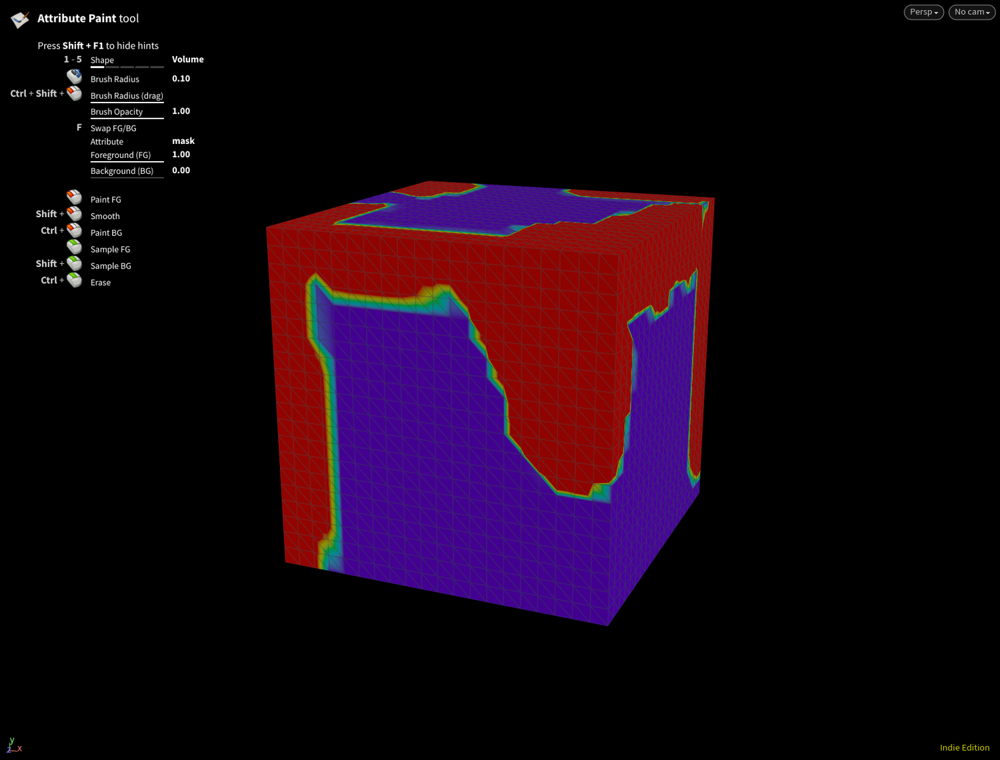
    </div>
    <div>
        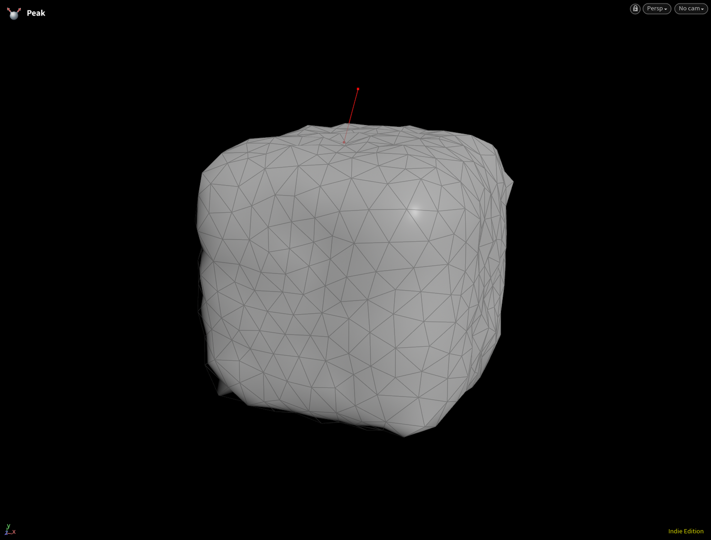
    </div>
    <div>
        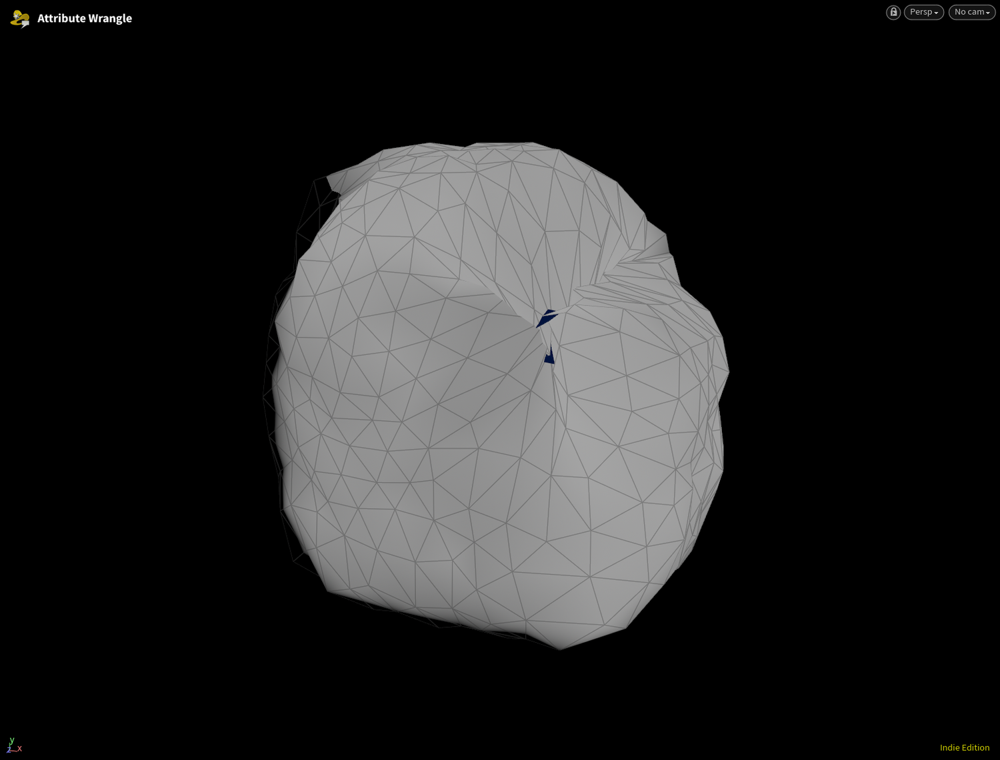
    </div>
</div>

<br>
From left to right, that’s our mask attribute, then the standard blur + noise combo, and then finally a vertex offset along the normals based on the mask attribute. This is done with some super simple VEX code:

```java
float mask = 1.0 - @mask;
@P += @N * mask * 0.1;
```

Now, you’ll probably be pretty sketched out by that last mesh. It is clearly self intersecting and doesn’t seem like it would play very nice with a boolean intersection on our original geometry. And that is totally true, it results in a pretty horrible output:

<div class="picture-subtitle">
    <div>
        <center>
            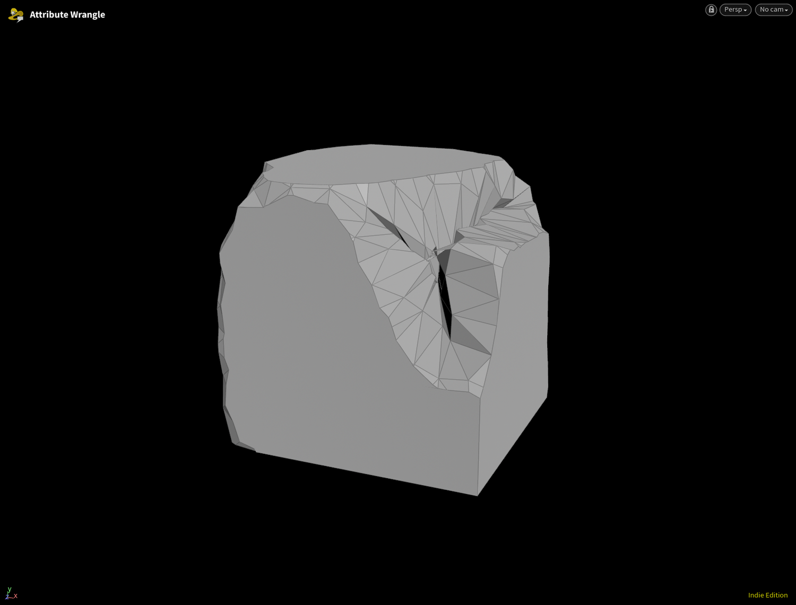
        </center>
    </div>
    <div class="subtitle">
        <center>
            oh no : (
        </center>
    </div>
</div>

<hr>
<br>

# Meshing

<br>
Actually what you saw above is a common limitation I see with procedural damage tools. If your input geo is complex enough, or your parameters are too crazy, it breaks the boolean operation you have to do at the end. This is especially an issue with our setup since we are pushing the verts even further in some cases for heavily damaged areas. 

\
However, the shape of our deformed geo is still _pretty_ close. Boolean operations work well on water tight meshes so here is a quick and simple way to clean up our geo. You basically just want to convert our geo into a VDB surface volume, and then convert it back to a normal polygon mesh. I find that if I keep the VDB resolution similar to the resolution of our original subdivision, it will still maintain most of the details. But you’re now left with a water-tight proxy mesh of what we had in the previous step.

<div class="side-by-side">
    <div>
        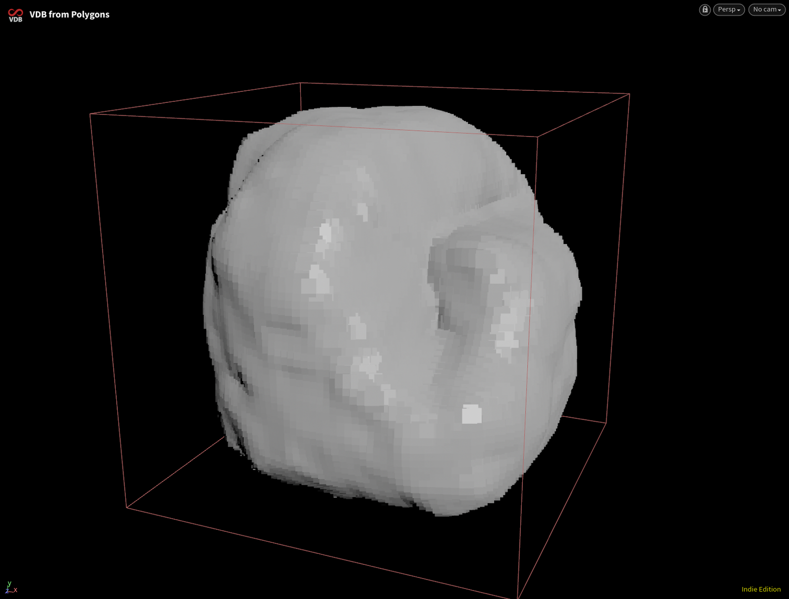
    </div>
    <div>
        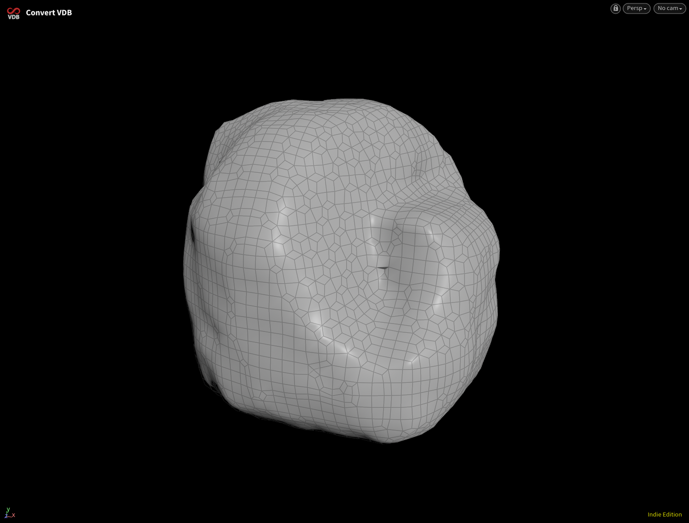
    </div>
</div>

\
 The next issue you’ll see is that after converting back to a polygon mesh, the structure is way too clean and uniform. So I do a second remeshing afterwards to reduce its polycount and make the details more irregular. I actual provide two methods of doing this, you can either use a Remesh node or a **PolyReduce** node. I prefer the **PolyReduce** node as the result is more consistent as you paint changes on to the mask, and it has a tendency to create sharper cuts / chipping.

<div class="side-by-side">
    <div class="picture-subtitle">
        <div>
            <center>
                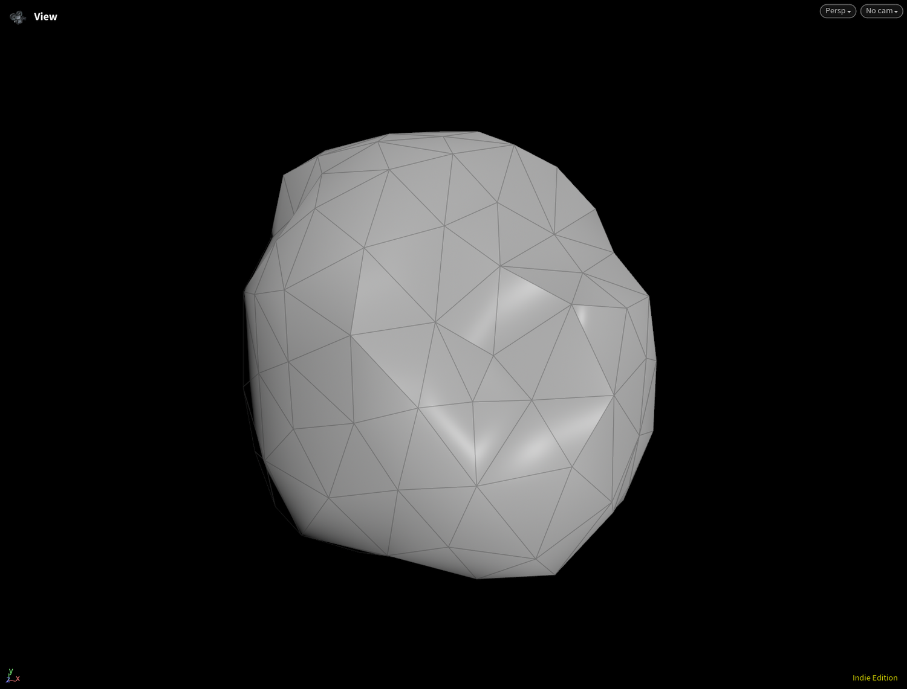
            </center>
        </div>
        <div class="subtitle">
            <center>
            Remesh
            </center>
        </div>
    </div>
    <div class="picture-subtitle">
        <div>
            <center>
                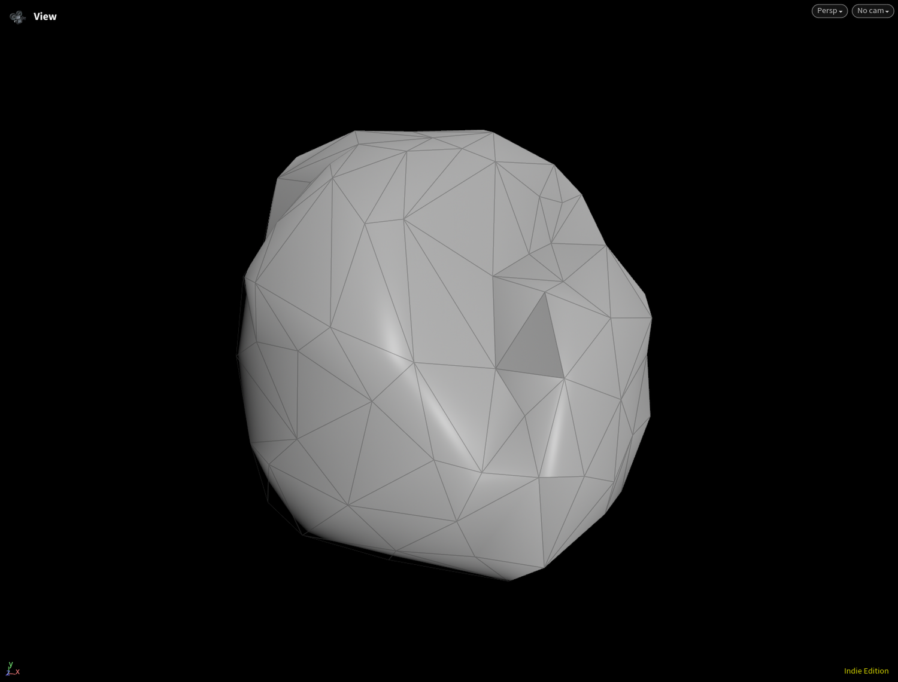
            </center>
        </div>
        <div class="subtitle">
            <center>
            PolyReduce
            </center>
        </div>
    </div>
</div>

All in all that leaves us with a pretty good and stable result to do a boolean intersection with

<center style="margin-top:2rem">
    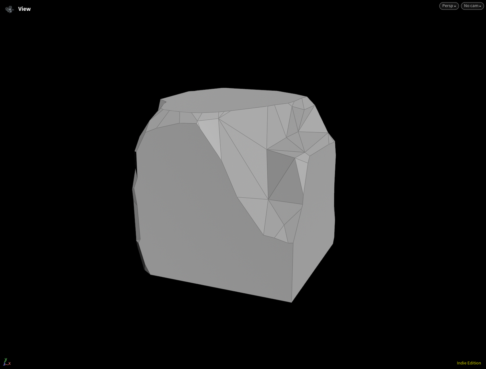
</center>


<hr>
<br>

# Custom Python Viewer State for Interactibility

\
The real beauty of this tool is that it has it’s own <a class="link" href='https://www.sidefx.com/docs/houdini/hom/python_states.html'> custom python viewer state</a> that lets you paint directly on your asset and quickly see the changes in your mesh. I wanted to include this section because as I looked for resources online on creating your own stroke viewer state, like the one you see in an attribute paint, I could not find a lot of information on how to actually set it up. So I eventually fumbled into a working implementation and wanted to relay the findings in case it helps anyone else down the road. 

\
We can package the entire network as it exists right now into a HDA but it’s kind of clumsy to use, you’d have to go into the network, select the attribute paint, paint on the mask, look at the output, go back to the attribute paint, etc… What we really want is just to expose all of the viewport controls to our root HDA. To start, we are going to create a new custom viewer state on our HDA

<div>
    <ul class="bullet">
        <div class="indent">
            <li>
                Open up the type properties of your HDA (Right click > Type Properties…)
            </li>
            <li>
                Go to the Interactive tab, and under the State Script section, create a new state script
            </li>
            <li>
                This will pop-up a code generator, it will basically give you some boilerplate code to get started. Since we are building a interactive painting tool, you will want to choose the Stroke sample.
            </li>
        </div>
    </ul>
</div>

<div class="side-by-side">
    <div>
        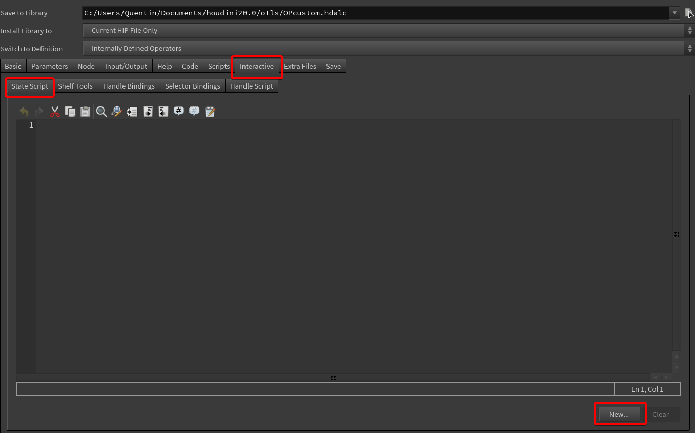
    </div>
    <div>
        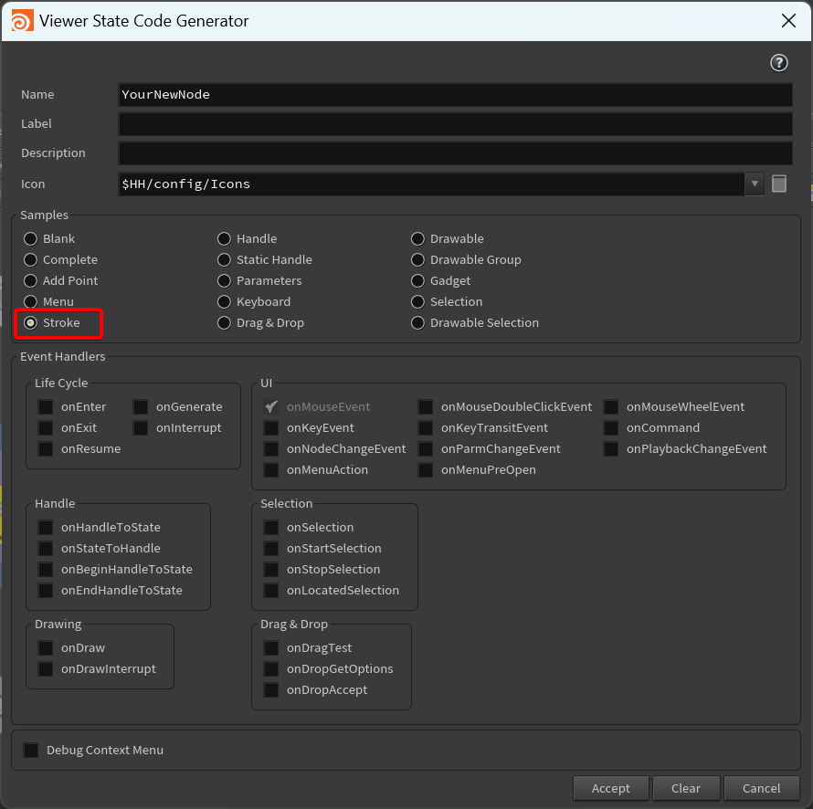
    </div>
</div>

\
Hit Apply on everything, and now you can edit your state code either in this state script tab. Or, (the better way) right click on your node and choose **Edit Extra Sections Source Code** which open it open it up in your configured text editor. You’ll see that it’s create a new class that derives from **StrokeState**. If you are curious, you can find the source code for that class in the houdini program files ***/houdini/viewerstates/sidefx_stroke.py***,  honestly just digging through that source code helped me figure out how all of this works lol.

\
You can enter your viewer state by selecting the node in the network graph, hover over the viewport and then hitting enter. You should see a cursor pop up, but unfortunately you’ll get a nasty error whenever trying to paint anything.

<div class="picture-subtitle">
    <div>
        <center>
            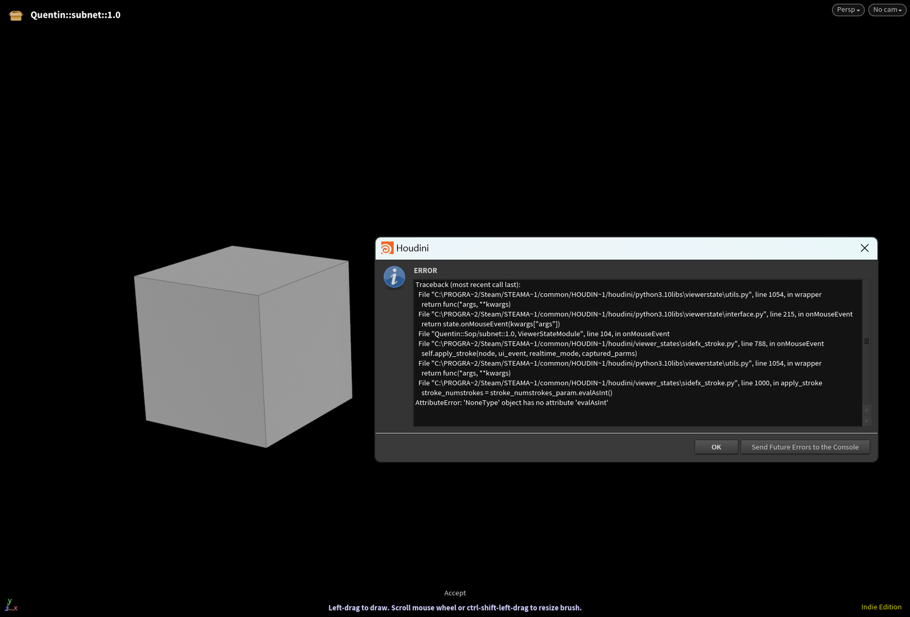
        </center>
    </div>
    <div class="subtitle">
        <center>
        oh no again : (
        </center>
    </div>
</div>

\
The issue is that the sample viewer state expects a bunch of stroke attributes on your HDA node (like stroke_attrib, stroke_radius, stroke_opacity, there is a ton of them). Basically what the viewer state is doing is taking the current value of these attributes and attaching them to the stroke geometry whenever you paint a new brush stroke. 

\
I’m not going to assume I know which ones are required for the viewer state to work and which ones are optional, so I’ll just relay the attributes I created on my HDA

<div>
    <ul class="bullet">
        <div class="indent">
            <li>
                <b>stroke_attrib</b> - The name of the attribute we are painting, in our case this is our mask attribute
            </li>
            <li>
                <b>stroke_float</b> - The value we are painting into the attribute, in our case this is the damage strength
            </li>
            <li>
                <b>stroke_attribtype</b> - The type of the attribute, I set the default for this to 1 as we are working with float attributes
            </li>
            <li>
                <b>stroke_radius</b> - The radius / size of the cursor
            </li>
            <li>
                <b>stroke_opacity</b> - The opacity of the stroke
            </li>
            <li>
                <b>stroke_softedge</b> - The falloff on the stroke, I just leave this at 0.5 for simplicity
            </li>
            <li>
                <b>stroke_projtype</b> - How we are projecting the stroke in the viewport, I set this to 4 which is the value for projecting onto our geometry.
            </li>
        </div>
    </ul>
</div>

\
If you’re wondering where all those magic default values came from, I unfortunately have to tell you it was from digging through the source python code and looking at how the attribute paint node is set up.

\
These are the stroke settings, but we also need to set up attributes that hold the actual stroke geometry, which will be an array of brush strokes that populates as the user interacts with the tool. We need to pass this data down to our attribute paint node, so the easiest way to do this is just linking the attribute paint’s stroke geo to our root HDA. If you go into the stroke tab of the attribute paint you should be able to drag the strokes array into your HDA’s type properties.

<center style="margin-top:2rem">
    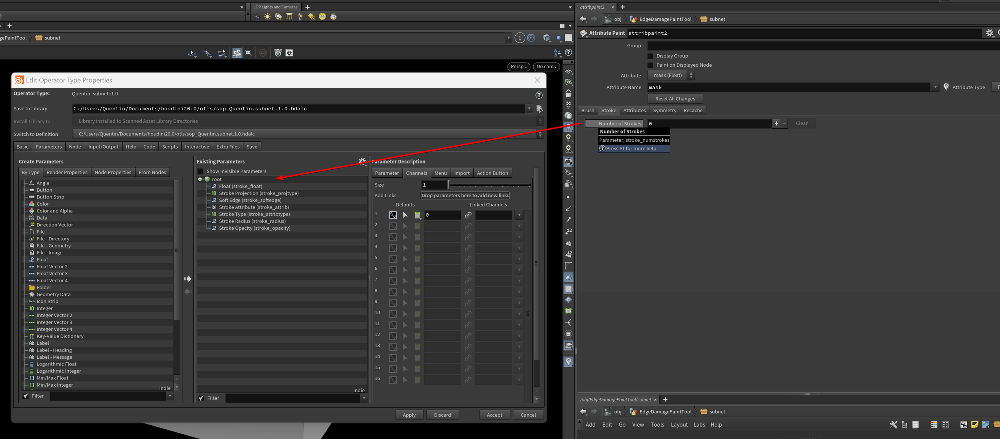
</center>

\
**NOTE:** There is one more gotcha. The attribute paint stroke array has an invisible parameter called stroke#_color that will not get brought over when you drag and drop the parameter like this. You have to do this manually in your HDA properties or else you’ll get a python error. This has no impact on the actual functionality since we don’t use the stroke color at all, you’ll just need to make sure you have it in there.

<center style="margin-top:2rem">
    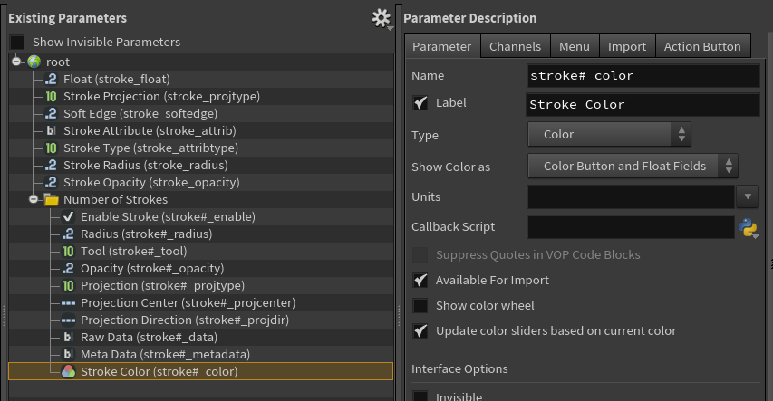
</center>

\
Assuming there were no roadbumps, you now technically have a working stroke viewer state you can now expand on. If you do run into problems, you can check out the **Viewer State Browser** to check out any error messages or logs. You’ll know it’s working correctly if you can see the stroke data being populated in the stroke geo array.

<center style="margin-top:2rem">
    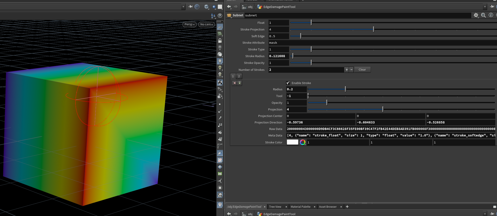
</center>

\
From here, it’s really up to you on how you want to customize it. I just wanted to show off a general guide on how you can get it into a working state. One trick I implement in my tool is to have multiple different “view states“ which is controlled by a switch node before the final input driven from an attribute in the HDA.

<center style="margin-top:2rem">
    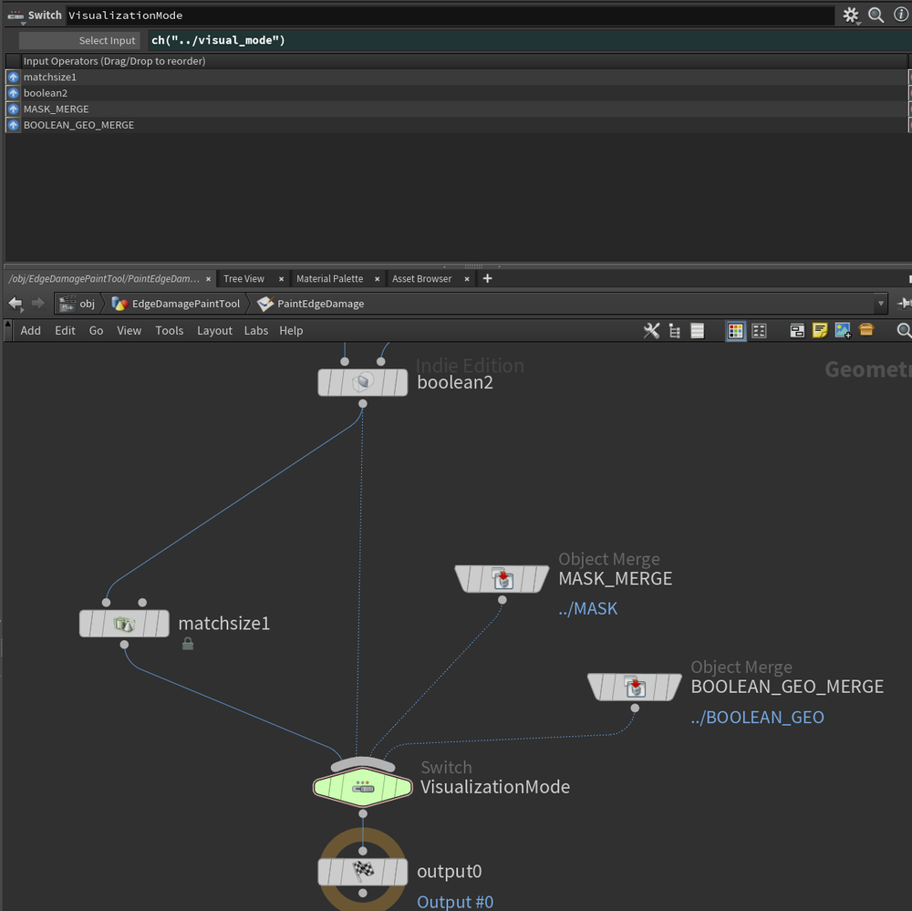
</center>

\
This lets users switch between viewing the mask, output, boolean geometry with some hotkeys. I’m basically just linking up some hotkeys and menu actions in my **createViewerStateTemplate()** function, and then I modify the visual_mode attribute based on the events I get in the **onMenuAction()** function.

\
Another super useful feature I implemented in the HDA is to cache the geometry strokes and pass them into the attribute paint network which helps performance a ton. But for all the actual python implementation I encourage you to download the project and check it out : )