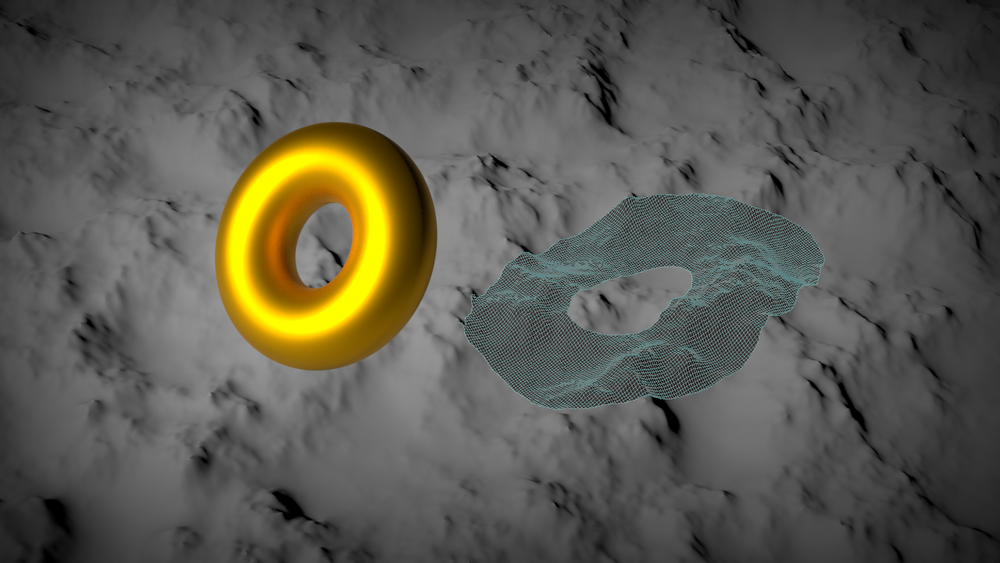
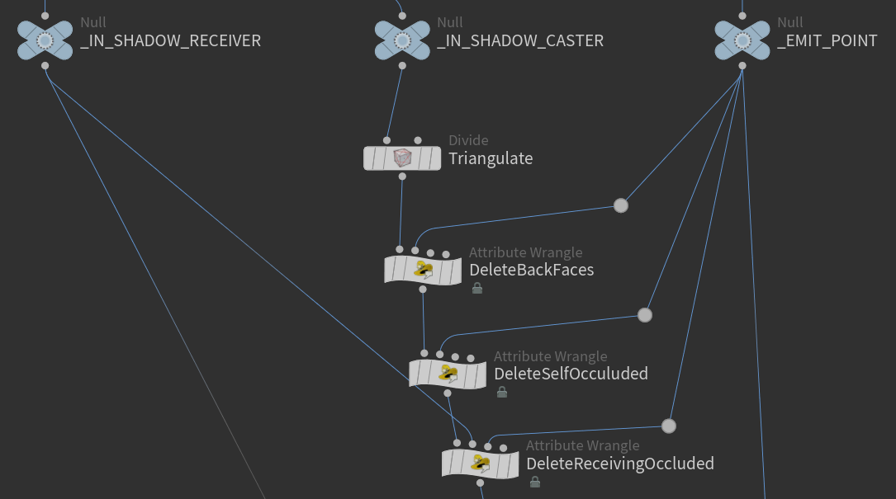
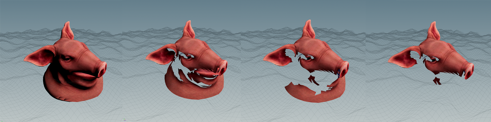
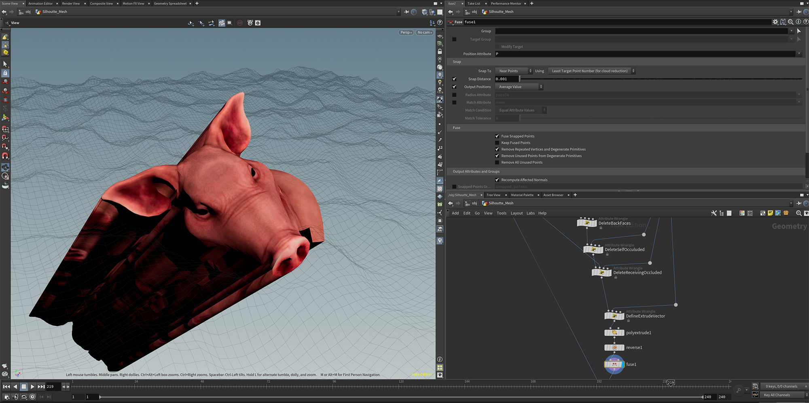
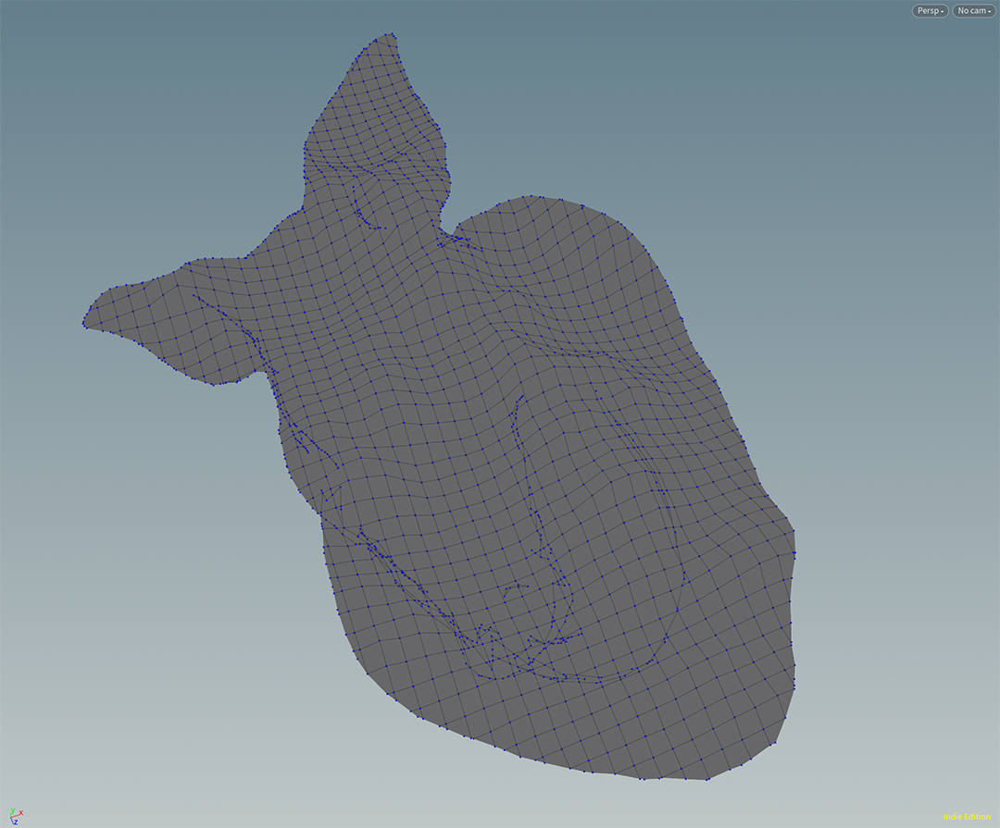
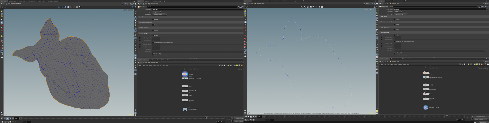
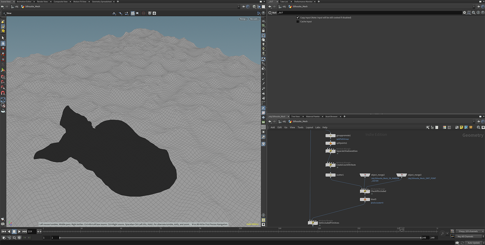

    

\
\
Ok, so first off, why would you want to do this?

\
When I first started this project I was intrigued by a problem I once heard from someone in the industry for a game that they had worked on. It was a low-poly game with static lights casting hard shadows. When using shadow or light maps, you are bound by the resolution of that texture. If you want it to look good from all distances you’re looking at possibly storing a lot textures or at least mip maps into memory. Even then, someone could probably still see the pixelated artifacts of the texture if they look hard enough.

\
But what if, instead of baking it into a texture, you actually baked it into polygons? You would certainly increase the poly count in the scene, but if it’s low poly, cutting out that shadow projection might not have that great of an impact. If you throw on a shadow material on to that new mesh you are essentially getting a pixel perfect shadow of an object that looks great no matter where you are viewing it from. 

\
Hopefully... that at least justifies why I think this may be useful for someone somewhere. When I’m trying to do some mesh manipulation tools I feel most comfortable trying to prototype it in Houdini and see where I get. 
 

    

        <ul class="bullet">
            Firstly, I want to create a shadow volume from my casting object, which I’ll later use in a Boolean operation to cut out a intermediary mesh from our receiving object. The casting mesh might be fairly complex, so I do three culling passes with vex in order to reduce the complexity of it, and to reduce self intersections within the volume. It’s loosely based on generating the shadow volumes for shadow mapping. The steps I follow are laid out here
             
             
            <li>
                Use a divide node to triangulate the mesh so that all primitives are flat
            </li>
            <li>
                First, cull out all the backfaces relative to the lights position
            </li>
            <li>
                Secondly, cull all primitives that are occluded by other parts of the casting object 
            </li>
            <li>
                Thirdly, cull all primitives that are occluded by the receiving object
            </li>
        </ul>
    

    

        
    

    

        

            
        

    

    

        

            The mesh after each step in the culling process, which leaves you with a light facing hull that has the same silhouette as your original mesh
        

    

    

        

            
        

    

    

        

            Create an attribute for each point that points in the direction away from the light source, and then extrude along those vectors. This will give you a (horrifying looking) shadow volume that you can use to Boolean against your receiving mesh. After you take the intersection between the two, it will look like you have that shadow mesh already, however…
        

    

    

        It will probably be a pretty garbage looking mesh.
          
        Houdini has a really easy way to extract the border edges of surface meshes though. You can throw down a group node and select unshared edges which will give you all of edges along the perimeter.
          
        From there, I do a bit of cleanup by closing and fusing all the curves and using the polypath node in order to make each curve into a single primitive (Important for performance in the next few steps). 
    

    

        
    

    

    

        For each curve generated, I do a polycut into the receiving object to slice out the silhouette.
          
        I set up a feedback for loop here to make multiple cuts if needed. Depending on the topology of the casting mesh the silhouette may be made up of a bunch of curves.
          
        This is also why I made each curve it’s own primitive, so we minimize the number of polycut operations we have to do. We could do a polycut for each edge but it would slow down the generation by a ton.
    

    

        
    

    

        Finally, the last step is to iterate over the resulting primitives and see if they are part of the shadow or not. I would love to know if they is a more elegant way to do this but alas I ended up doing it a bit of a brute forced kind of way.
          
        I scatter a point on each primitive (so I know it lies on the surface of it), and then cast a ray towards the light source and see if I hit the casting object. If I do, I mark that primitive as being in the shadow.
          
        That’s it! You have a clean mesh of the shadow projection from one object on to another. The overall computation time is still very fast so you could easily incorporate this into game engine with Houdini Engine and make some nice editor tools : )
    

    

        
    

