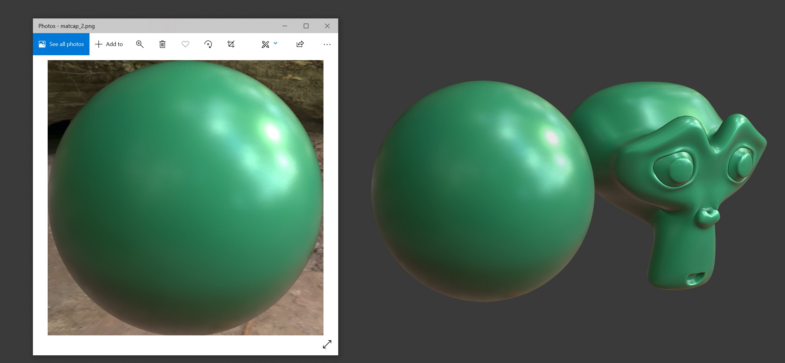
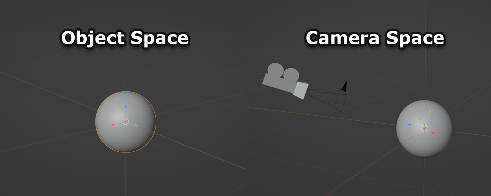
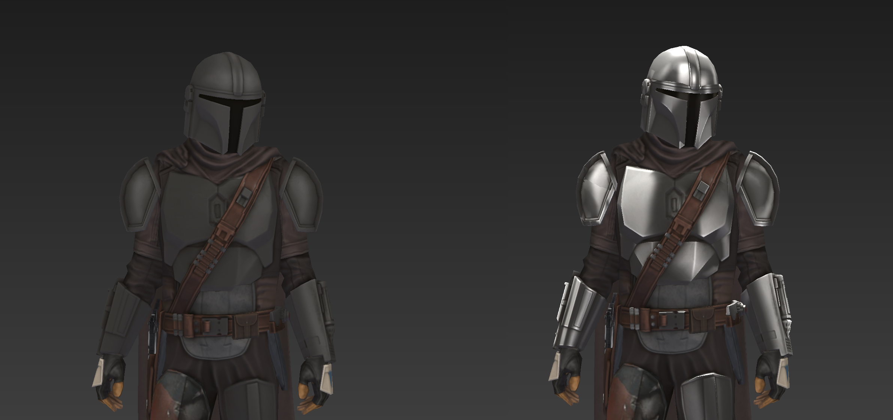
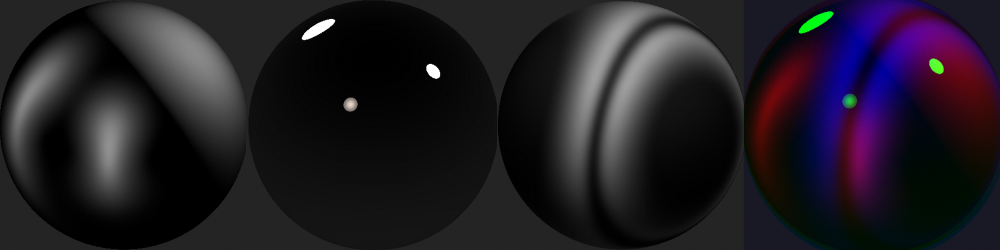

<center style="margin-top:2rem">
    
</center>

\
At one point when working on the Disney Magic Kingdoms project we got the go ahead to implement Star Wars characters and content into the game. From the art team’s perspective, it was a major deviation from the cartoony and vibrant look we had been using for many of the other Disney properties, so we knew we would have to face some challenges getting it into the game. The use of metals and glossy materials needed an updated shader in order to make them pop within the park. 

\
Since we target some ancient mobile hardware, we wouldn’t be able to use high-end PBR art rendering techniques, but they still needed to look realistic on low end devices. 

\
In general, when I am trying to fake expensive shader computations, I try to consider all the ways I can bake intermediate data into things like textures or vertex attributes. In this case, I wanted to try and bake dynamic lighting data offline somehow. This seems tricky, but luckily we have a very cartoon-y art style, so at the end of the day we only care that it looks plausible enough.   

<div class="side-by-side">
    <div>
Which made me consider <b>MatCaps</b> as a possible solution for this.
If you are unaware of what they are, it stands for “Material Captures“. You capture a material by taking a photo (or rendering an image) of a sphere with the properties and lighting conditions of the material you want to copy. 
</br>
Notice that a front facing photo of a sphere has every camera-facing normal in a single image, so if that sphere mimics the material and lighting conditions you want, all you need to do is map the normal of your model to UV coordinates on the MatCap texture. 
    </div>
    <div class="picture-subtitle">
        <div>
            <center>
                
            </center>
        </div>
        <div class="subtitle">
            <center>
                A MatCap example in Blender. The image used is shown on the left and is applied to the Sphere and the Suzanne model on the right.
            </center>
        </div>
    </div>
</div>

\
The code to do this is actually pretty simple. In your vertex stage you just need to calculate the view normal and pass it into the fragment stage through a varying like so (where MAT_ModelToView is your engine’s model space to view space transformation matrix):

```glsl
vec3 viewNormal = normalize(MAT_ModelToView * vec4(Normal.xyz, 0)).xyz;
```

\
While in model space, the normal of your surface is relative to the models orientation. However, in view space, everything is relative to the camera. Your x and y coordinates now correspond to the left/right and up/down of the camera. Your z coordinate is now the vector pointing in and out of your camera. All we need to do in the fragment shader is to remap the normal into UV space so we can sample the texture ( In essence, from [-1, 1] to [0, 1] ).

<center style="margin-top:2rem">
    
</center>

```glsl
mediump vec2 matcapNormal = viewNormal.xy;
matcapNormal = matcapNormal * vec2(0.5, -0.5) + vec2(0.5, 0.5);
gl_FragColor = texture2D(MatCapTEX, matcapNormal);
```

\
However, that just pastes the matcap texture onto your mesh ( which can still look cool! ). But we want to use our existing albedo and augment it with specular highlights driven by the matcap texture. Therefore, we want to sample a diffuse texture with the model’s uv coordinates and paste the matcap on top of it.

```glsl
mediump float shadow = SampleShadowMap(); 
mediump vec4 diffuse = texture2D(DiffuseTEX, vCoord0);
mediump vec4 matcap = texture2D(MatCapTEX, matcapNormal);

gl_FragColor = (diffuse * DiffuseAmnt + matcap * MatCapAmnt) * shadow;
```

\
This is an overly simply example of how I implemented it, but its the root idea. In reality I also implemented many different blending algorithms (like photoshop layers) to blend the Diffuse and MatCap textures, which gave artists the control to get the look they want.

<center style="margin-top:2rem">
    
</center>

<div>
    <ul class="bullet">
        <br>
        There are a few other tricks you can do with this:
        <div class="indent">
            <li>
                Use the alpha channel of the diffuse as a mask to prevent reflections on unwanted parts of the mesh (like leather).
            </li>
            <li>
                If you only care about light intensity in your MatCap (and not color), you can actually combine three different MatCaps into one texture where each RGB channel corresponds to one of the textures.
            </li>
        </div>
    </ul>
</div>

<center style="margin-top:2rem">
    
</center>

\
Now, you can use the vertex color of your mesh to sample from the different MatCaps, effectively allowing you to use three different MatCaps textures on one mesh for no extra cost. 

```glsl
mediump float matcapTotal = matcap.r * vColor.r + matcap.g 
                            * vColor.g + matcap.b * vColor.b;
gl_FragColor = (diffuse * DiffuseAmnt + matcapTotal * MatCapAmnt) * shadow;
```

<div>
    <ul class="bullet">
        <br>
        Some benefits of this shader technique:
        <div class="indent">
            <li>
                Super flexible for artists. They can paint these MatCaps, and they can also render them out by pointing an orthographic camera at a sphere in whatever software they like. It allows artists to create both NPR or PBR materials.
            </li>
            <li>
                Its only a texture lookup! No computations so your shaders are super low cost in terms of shader instructions.
            </li>
        </div>
    </ul>
</div>

<div>
    <ul class="bullet">
        <br>
        And the downsides:
        <div class="indent">
            <li>
                Since we are looking up the texture by the view-normal, as the camera rotates around, the lighting appears to follow it regardless if it actually makes physical sense. For our case, we essentially just don’t care. The camera in game doesn’t rotate very drastically, and we weren’t going for a perfect physical replication, just whatever looked good.
            </li>
            <li>
                Technically requires a bit more VRAM because we have to load in the MatCap texture. Usually we can keep these textures pretty small (256x256 at most) and they can be shared for many different assets, so their memory footprint remained very small.
            </li>
        </div>
    </ul>
</div>